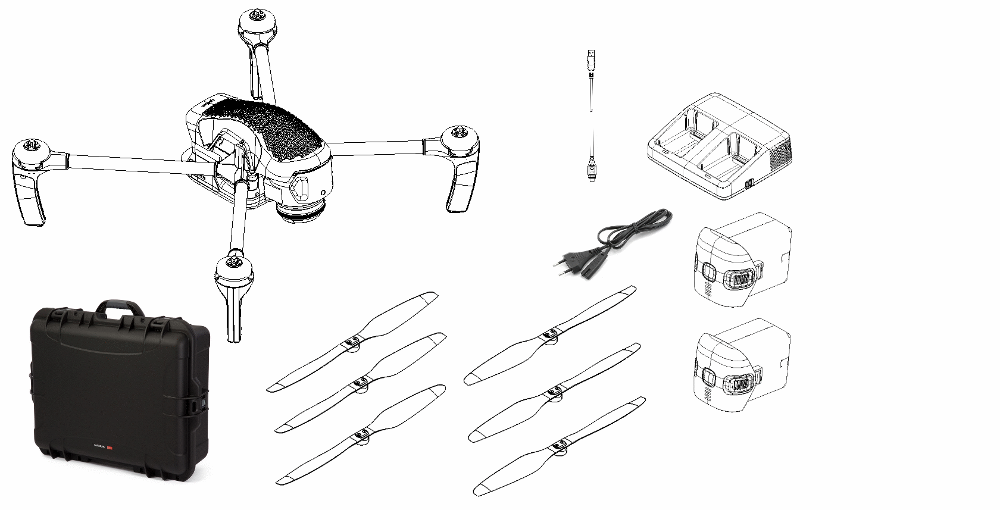

.. Geoscan Gemini documentation master file, created by
   sphinx-quickstart on Tue Oct  1 12:10:10 2019.
   You can adapt this file completely to your liking, but it should at least
   contain the root `toctree` directive.

Руководство пользователя Геоскан Gemini
==========================================

Общие сведения
-----------------
Геоскан Gemini – это беспилотный аэрофотосъемочный комплекс на базе квадрокоптера. Он предназначен для получения высококачественных геопривязанных фотографий местности и отдельных объектов.

Комплект поставки
--------------------
* Квадрокоптер в сборе;
* Воздушные винты – 3 пары;
* Аккумуляторная батарея (АКБ) – 2 шт.;
* Зарядное устройство (ЗУ);
* Кабель питания ЗУ;
* Наземная станция управления;
* Модем КРЛ;
* Транспортировочный кейс;
* USB-кабель.

Обслуживание
---------------
После каждого полета осматривайте БВС на предмет повреждений.

При повреждении лопастей винтов вы можете заменить их самостоятельно, используя запасные.

В случае повреждения других элементов БВС или отказе электронных систем необходимо обратиться в `службу технической поддержки <https://www.geoscan.aero/ru/support>`_.

При достижении суммарного времени налета 80 часов рекомендуется отправить БВС на завод-изготовитель для проверки и технического обслуживания.

Хранение
---------------
Комплекс Геоскан Gemini (без аккумуляторных батарей) и зарядное устройство рекомендуется хранить в транспортировочных кейсах в сухом помещении при температуре от 5 до 25 °С и относительной влажности не более 85%, без конденсации.

Аккумуляторные батареи хранить в сухом прохладном месте, исключающем воздействие прямых солнечных лучей, при температуре от 5 до 25 °С и относительной влажности не более 80%. Срок хранения - 1 год. 

.. attention:: Для хранения аккумуляторных батарей переведите их в состояние “Storage” с помощью зарядного устройства. Подробнее в разделе :doc:`charger`.

.. toctree::
   :maxdepth: 2
   :caption: Содержание:

   reference
   precautions
   charger
   planner
   radiolink
   uav
   preflight
   specs

* :ref:`genindex`
* :ref:`modindex`
* :ref:`search`
