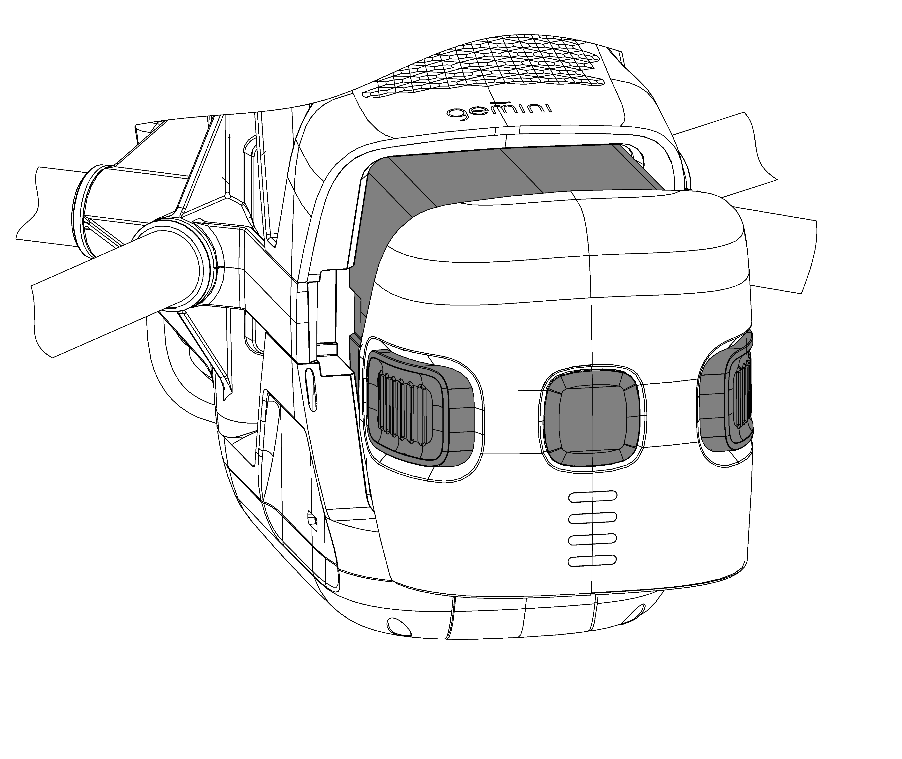
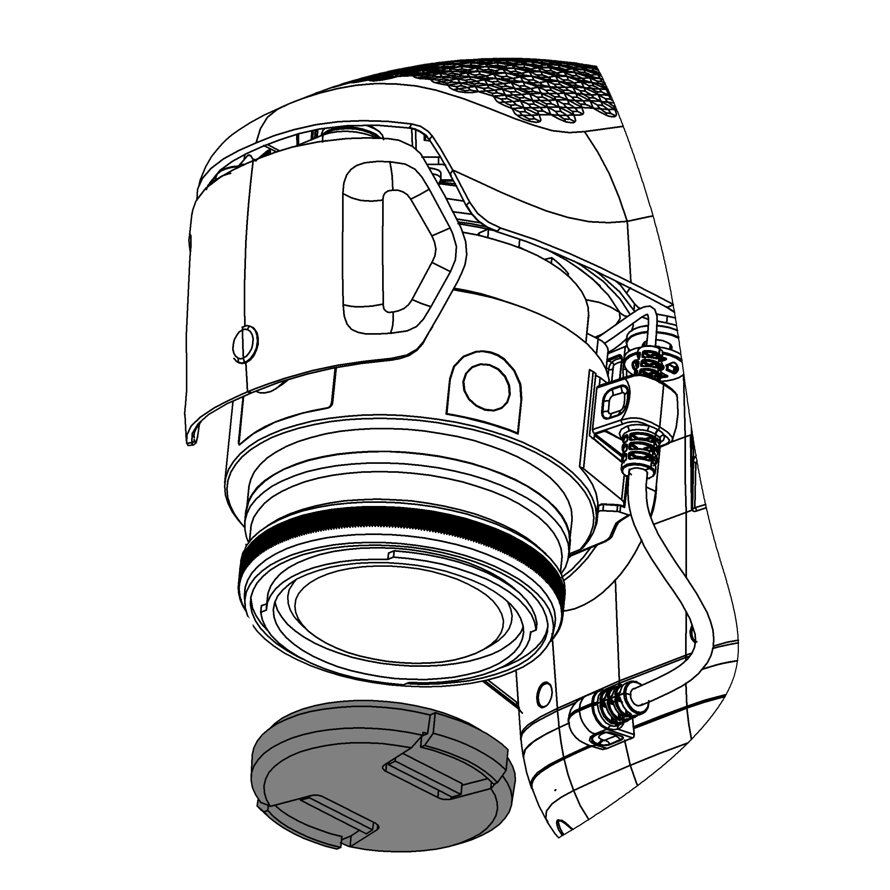

Предполётная подготовка
========================

Условия полета (скорость ветра, освещенность, осадки) 

Полетные ограничения и зоны, запрещенные для полетов 

1. Не используйте БВС в сложных погодных условиях, таких как снегопад, дождь или при скорости ветра 10 m/s. 
2. Не допускайте полётов вблизи высотных объектов и массивных металлических конструкций. Они могут повлиять на точность показаний магнитного компаса и прием сигналов GPS.
3. Избегайте таких объектов как опоры ЛЭП, деревья и водоемы, а также скопления людей.
4. Минимизируйте взаимодействие с электромагнитными полями высокой энергии. 
5. Производительность квадрокоптера и батареи зависит от внешних условий, таких как температура воздуха и влажность. Будьте осторожны, используя квадрокоптер на высоте более 6 000 метров над уровнем моря. 
6. Квадрокоптер не приспособлен для работы в условиях высоких (полярных) широт. 

Зоны, запрещенные для полетов 
-------------------------------

При планировании полетного задания ПО Геоскан Planner позволяет учитывать расположение бесполетных зон. Квадрокоптер не выполнит команду на взлет в пределах такой зоны. 

Калибровка компаса (+описание процесса калибровки) 
--------------------------------------------------------

Калибровка необходима при полете в новой локации. Магнитный компас очень чувствителен к помехам, которые могут повлиять на качество полета. 

* Не выполняйте калибровку в местах, где возможно влияние сильных электромагнитных полей. Источниками таких полей могут служить массивные металлические объекты, как на поверхности, так и погребенные под ней. 

Процедура взлета и посадки 

Что следует проверить перед началом полета
-------------------------------------------

Чтобы запустить Геоскан Gemini:

1) Зарядите АКБ (см. :doc:`charger`).
2) Спланируйте полетное задание, используя Geoscan Planner (см. :doc:`planner`). Сохраните полетное задание, чтобы быстро загрузить его перед вылетом. 

3) Установите воздушные винты на оси моторов БВС. Обратите внимание, что винты отличаются по направлению вращения. Используйте цветовую маркировку на осях моторов и винтов, они должны совпадать. Накручивайте каждый винт на ось, придерживая внешнюю часть мотора второй рукой. Пиктограмма на центральной части воздушного винта указывает направление, в котором его нужно накручивать при установке. 

Пиктограмма на центральной части воздушного винта указывает направление, в котором его нужно накручивать при установке. Чтобы снять винт, откручивайте его в противоположном направлении. 

.. figure:: _static/_images/props12.png 
   :align: center
   :width: 600

   Установка воздушных винтов

4) Отформатируйте SD карту памяти и установите ее в слот в задней части БВС. Убедитесь что карта надежно зафиксирована в слоте и извлекается только при повторном нажатии. 

.. figure:: _static/_images/sdcard.PNG 
   :align: center
   :width: 600

   Установка карты памяти

5) Установите аккумуляторную батарею, задвинув ее до щелчка в корпус квадрокоптера. Для активации АКБ необходимо выполнить одно короткое и одно длинное нажатие кнопки управления. Активируйте подачу питания одним коротким и одним длинным нажатием кнопки управления. 

   Установка АКБ в отсек БВС 

6) Перед началом полета снимите крышку объектива. 

   Не забудьте снять крышку с объектива камеры 

7) Установите БВС на взлётную площадку и убедитесь, что воздушные винты свободно вращаются. 
8) Откройте полетное задание в Geoscan Planner. Запустите мастер предстартовой подготовки. Убедитесь в успешном прохождении предстартовой подготовки. 
9) Нажмите на кнопку **Старт** в окне Geoscan Planner. 

БВС осуществит взлет и начнет выполнение полетного задания. 

Порядок разборки БВС
========================

1) Деактивируйте АКБ так же как при включении (одно короткое и одно длинное нажатие кнопки управления). Нажмите на установочные защелки и извлеките АКБ из отсека БВС. 
2) Установите крышку на объектив фотокамеры.
3) Снимите воздушные винты, вращая каждый из них в направлении, противоположном указанному на пиктограмме. При этом придерживайте внешнюю часть мотора. Уложите воздушные винты в транспортировочный кейс. 
4) Извлеките SD карту памяти из слота БВС. 