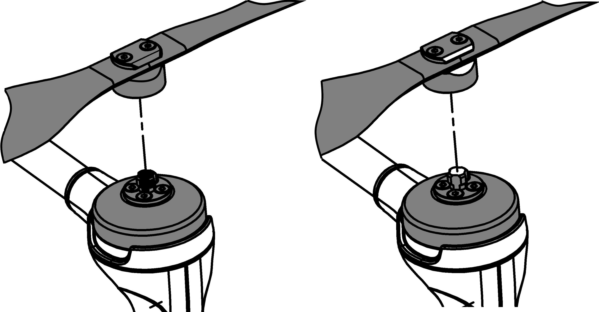
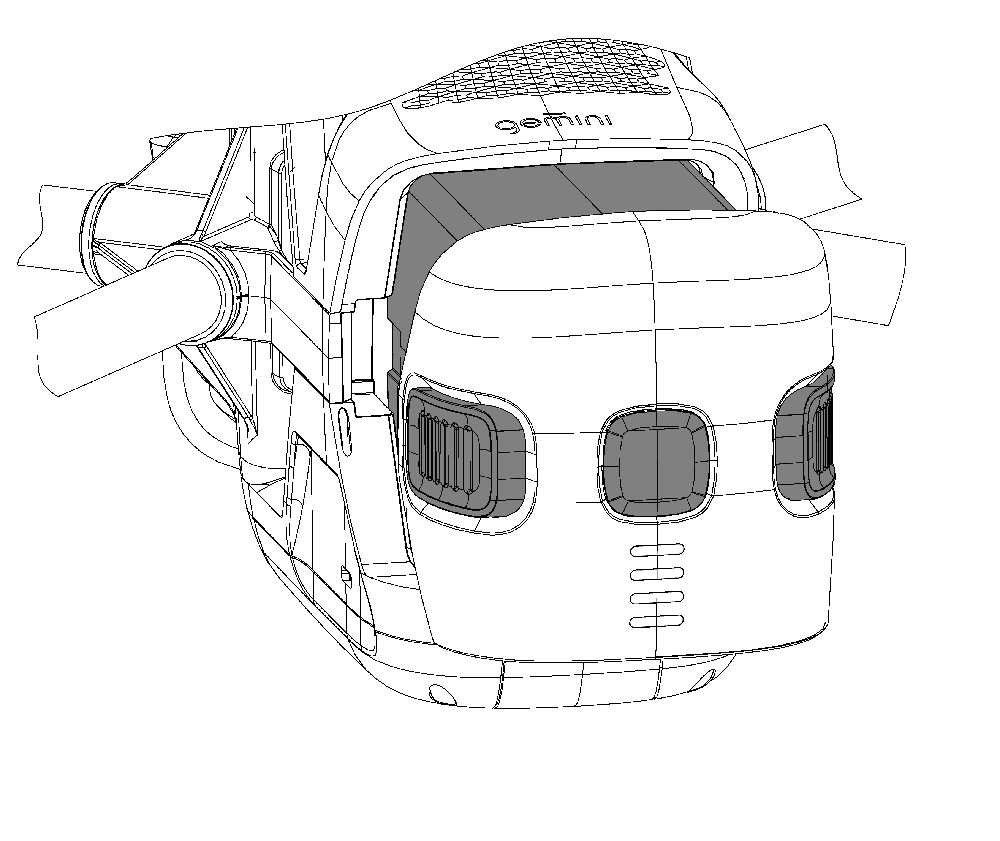
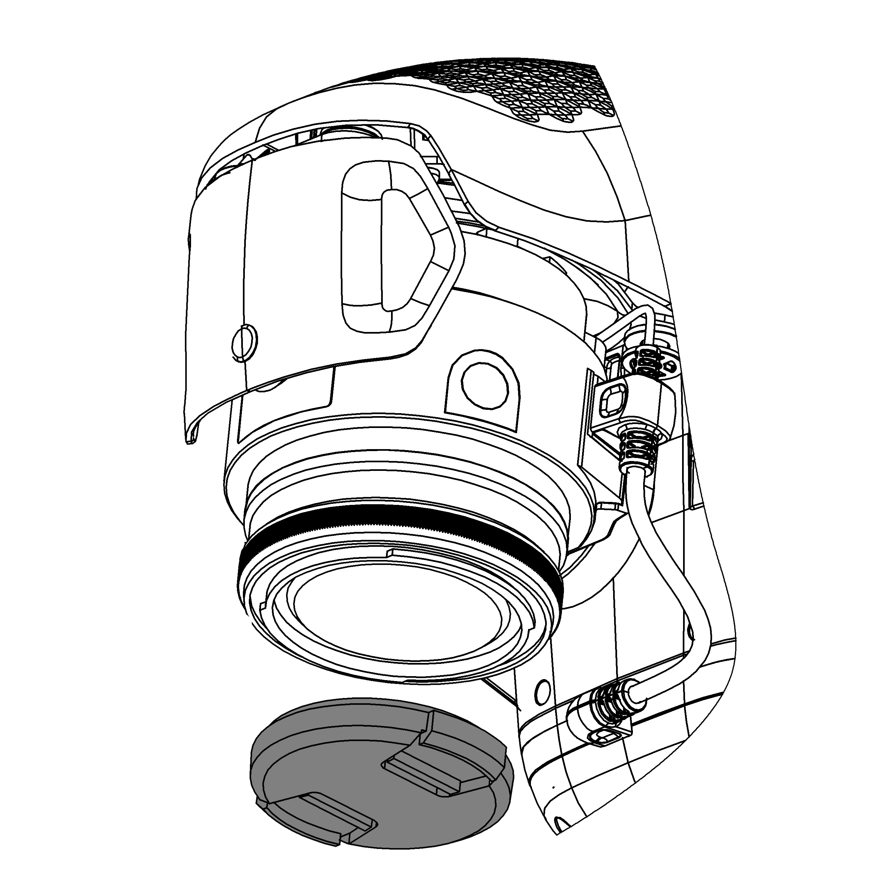

БВС
=======================

Компоненты и разъемы
----------------------

рисунок, на котором помечены основные части БВС

USB Type-C
MicroSD card

Работа с внутренним накопителем и внешними подключениями. 
----------------------------------------------------------------
Данные аэрофотосъемки хранятся на внутреннем ssd накопителе квадрокоптера. Фотографии и геоданные сохраняются в коневой каталог в папки Photo и Data соответственно. Для их копирования на внешний носитель для просмотра и обработки предусмотрено три способа: 

* прямое подключение БВС к компьютеру кабелем USB Type-C 
* копирование данных на карту microSD 
* передача данных на базовую станцию по беспроводному протоколу Wi-Fi 

Система автоматического управления БВС (описание)
------------------------------------------------------

Для полета не требуется прямое участие оператора. Полетное задание создается заранее и загружается в память БВС непосредственно перед взлетом. Весь полет происходит в автоматическом режиме. При этом оператор с помощью наземной станции управления может отслеживать параметры движения и при необходимости корректировать задание. 

Индикация состояний БВС
----------------------------

+-------------------+--------------------------------+--------------------------------------------------+
| Индикация         | Описание                       | Что делать                                       |
+===================+================================+==================================================+
| красный горит     | критическая ошибка             | обратитесь к производителю                       |
| красный мигает    | критический уровень заряда АКБ | установите заряженную АКБ                        |
| фиолетовый горит  | магнитометр не подключен       | дождитесь подключения магнитометра               |
| фиолетовый мигает | не найден бортовой компьютер   | дождитесь подключения бортового компьютера       |
| желтый горит      | калибровка магнитометра        | дождитесь завершения калибровки                  |
| желтый мигает     | ошибка магнитометра            | переместите БВС дальше от металлических объектов |
| синий горит       | GNSS не готов                  | дождитесь готовности GNSS                        |
| синий мигает      | ИНС не нагрелась               | дождитесь нагрева ИНС                            |
| зеленый горит     | готов к взлету                 |                                                  |
| зеленый мигает    | ожидание готовности к взлету   | дождитесь готовности к взлету                    |
| голубой мигает    | синхронизация SD карты         | дождитесь завершения синхронизации               |
+-------------------+--------------------------------+--------------------------------------------------+

Возврат домой (RTH)
---------------------
Функция возврата домой позволяет квадрокоптеру самостоятельно вернуться в точку взлёта и совершить посадку без прямого участия оператора. Она активируется в трех режимах:

* По требованию оператора; 
* Аварийный (в случае ошибки или повреждении БВС)+ failsafe индикация ошибки на корпусе БПЛА:

(таблица с индикаторами состояний или ссылка в начало страницы):

1. потеря сигнала GPS 
2. ошибка автопилота 
3. повреждение воздушных винтов 
4. потеря связи с НСУ 
5. недостаточный уровень заряда АКБ 
6. низкий заряд батареи. 

При разряде батареи до уровня, необходимого для безопасного возвращения в точку старта, режим RTH активируется автоматически. Высота следования к точке посадки задается перед полетом исходя из условий рельефа. 

Система визуального позиционирования
-----------------------------------------
Квадрокоптер оснащен датчиками оптического позиционирования, которые отслеживают горизонтальные перемещения. Это обеспечивает повышенную безопасность при взлете и посадке. 

Бортовой регистратор («черный ящик»)
-----------------------------------------
Параметры БВС в полете записываются в отдельный файл (лог) и сохраняются на борту. После приземления его можно скачать и проанализировать. Скачивание лога доступно даже при повреждении аппарата, что помогает установить причины падения. 

Калибровка компаса 
--------------------------------------------------------

Калибровка необходима при полете в новой локации. Магнитный компас очень чувствителен к помехам, которые могут повлиять на качество полета. 

* Не выполняйте калибровку в местах, где возможно влияние сильных электромагнитных полей. Источниками таких полей могут служить массивные металлические объекты, как на поверхности, так и погребенные под ней. 
* Не выполняйте калибровку в помещении или автомобиле. 

Обновление прошивки БВС
-------------------------
По умолчанию прошивка БВС обновляется автоматически по Wi-Fi. При каждом включении базовая станция проверяет наличие обновлений и устанавливает последнюю версию. Для обновления прошивки БВС должно быть включена и находится в непосредственной близости от работающей базово станции. Процесс обновления может занимать до 10 минут. Не выключайте питание и не извлекайте АКБ до завершения обновления. 

Если автоматическое обновление недоступно, вы можете выполнить процедуру самостоятельно. Чтобы обновить прошивку Геоскан Gemini, подключите БВС к компьютеру с установленным ПО Geoscan Planner с помощью комплектного кабеля USB Type-C. Запустите программу и выберите пункт меню «обновление прошивки БВС». 

Сборка
----------

Установка винтов
^^^^^^^^^^^^^^^^^^

Установите воздушные винты на оси моторов БВС. Обратите внимание, что винты отличаются по направлению вращения. Используйте цветовую маркировку на осях моторов и винтов, они должны совпадать. Накручивайте каждый винт на ось, придерживая внешнюю часть мотора второй рукой. Пиктограмма на центральной части воздушного винта указывает направление, в котором его нужно накручивать при установке. 

Пиктограмма на центральной части воздушного винта указывает направление, в котором его нужно накручивать при установке. Чтобы снять винт, откручивайте его в противоположном направлении. 

   Установка воздушных винтов

.. Поворот объектива фотокамеры для перспективной съемки
.. ^^^^^^^^^^^^^^^^^^^^^^^^^^^^^^^^^^^^^^^^^^^^^^^^^^^^^^

.. При помощи Геоскан Gemini вы можете выполнять не только плановую, но и перспективную съемку. В таком случае точность трехмерных моделей будет значительно выше. 

.. Чтобы повернуть камеру на фиксированный угол (24 или 48 градусов), установите квадрокоптер на ровную твердую поверхность правым бортом к себе. Придерживайте корпус квадрокоптера левой рукой, при этом правой рукой потяните объектив на себя, поворачивая его вокруг центральной оси квадрокоптера против часовой стрелки. Чтобы вернуть камеру в исходное положение (надир), разверните квадрокоптер левым бортом к себе и потяните камеру на себя, поворачивая ее по часовой стрелке вокруг центральной оси квадрокоптера. 

Установка АКБ
^^^^^^^^^^^^^^^^^^

Установите аккумуляторную батарею, задвинув ее до щелчка в корпус квадрокоптера. Для активации АКБ необходимо одно короткое и одно длинное нажатие кнопки управления. Активируйте подачу питания одним коротким и одним длинным нажатием кнопки управления. 

   Установка АКБ в отсек БВС 

Защита объектива
^^^^^^^^^^^^^^^^^^

Защитная крышка не допускает повреждения и загрязнения линзы объектива камеры. Её разрешается снимать непосредственно перед взлётом в ходе предстартовой подготовки. 

   Не забудьте снять крышку с объектива камеры 

.. note:: Всегда устанавливайте защитную крышку на объектив сразу после приземления квадрокоптера. 

Требования к стартовой площадке?
------------------------------------

.. Взлетная площадка должна соответствовать всем требованиям по магнитной совместимости и не вносит искажений в зондирующий сигнал. Поблизости не должно быть массивных металлических объектов и высотных сооружений, зданий, которые могут повлиять на точность приема сигнала ГНСС. Также в радиусе 5 метров не должно быть деревьев и кустарников, которые могут помешать взлету и посадке квадрокоптера. необходимо следить за соблюдением правил безопасности, особенно в условиях ограниченного пространства. 

